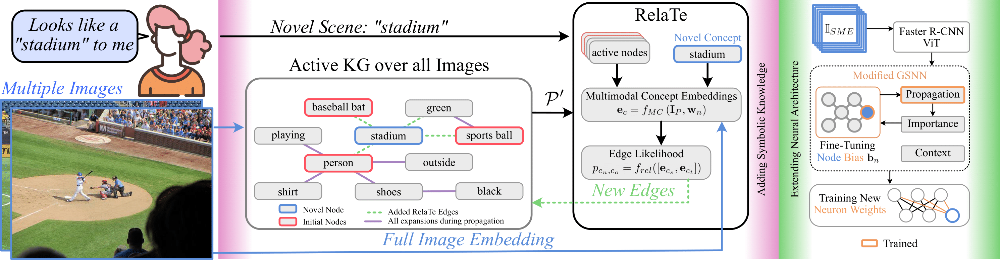

# Sample Efficient Learning of Novel Visual Concepts

This is a Pytorch implementation of the paper <b><i>"Sample Efficient Learning of Novel Visual Concepts"</b></i> published in the Conference on Lifelong Learning Agents (CoLLAs), 2023.

## Abstract

Despite the advances made in visual object recognition, state-of-the-art deep learning models struggle to effectively recognize novel objects in a few-shot setting where only a limited number of examples are provided. Unlike humans who excel at such tasks, these models often fail to leverage known relationships between entities in order to draw conclusions about such objects. In this work, we show that incorporating a symbolic knowledge graph into a state-of-the-art recognition model enables a new approach for effective few-shot classification. In our proposed neuro-symbolic architecture and training methodology, the knowledge graph is augmented with additional relationships extracted from a small set of examples, improving its ability to recognize novel objects by considering the presence of interconnected entities. Unlike existing few-shot classifiers, we show that this enables our model to incorporate not only objects but also abstract concepts and affordances. The existence of the knowledge graph also makes this approach amenable to interpretability through analysis of the relationships contained within it. We empirically show that our approach outperforms current state-of-the-art few-shot multi-label classification methods on the COCO dataset and evaluate the addition of abstract concepts and affordances on the Visual Genome dataset. 

## Approach



## Citation

In case you find our work useful, consider citing:
```
@article{Bhagat2023SampleEfficientLO,
  title={Sample-Efficient Learning of Novel Visual Concepts},
  author={Sarthak Bhagat and Simon Stepputtis and Joseph Campbell and Katia P. Sycara},
  journal={ArXiv},
  year={2023},
  volume={abs/2306.09482}
}
```

## Index

1. [Environment Setup](#setup)
2. [Dataset Preparation](#dataset-preparation)
3. [Training our Model](#training)
4. [License](#license)

## Setup

In order to build a ```conda``` environment for running our model, run the following command:
```
conda env create -f environment.yml
```

Activate environment using:
```
conda activate concept_learning
```

## Dataset Preparation

* Download the images for <a href="http://visualgenome.org/">Visual Genome dataset</a>. <br>
* Download the knowledge graph generated from Visual Genome and the augmented with <a href="https://wordnet.princeton.edu/">WordNet dataset</a> from <a href="https://drive.google.com/file/d/12qZD6LWI0xVSnKsQCBG7ehYhCeZB6LGC/view?usp=sharing">this link</a>. <br>
* Download the pretrained embeddings from <a href="https://drive.google.com/drive/folders/1IG0WQL6rtmNW1PMntz464_d5v0NDT49b?usp=sharing">this link</a>.
* We also need to prepare the ```.pth``` files for training our model. For this we need to create a directory called ```filtered_data_train``` and ```filtered_data_test``` in the source directory. <br>
Make sure you add only samples corresponding to the known concepts in the ```filtered_data_train``` and the images corresponding to the novel concepts can be placed in ```filtered_data_test```.<br>
In each folder, we need to place all the ```.pth``` files where each sample is a dictionary with the following keys:<br>
    - ```name```: Name of the image corresponding to the sample.<br>
    - ```present```: Ground truth labels for the sample.
    - ```detections```: Detections from Faster R-CNN. Each detection is represented as a dictionary which consists of the following keys:
        - ```class_ind```: Detection indices (0-80) for classes detected by Faster R-CNN
        - ```conf```: Confidence of predictions (0-1) from Faster R-CNN

## Training

Make sure you add your Visual Genome dataset location in the arguments file. <br> 
To train our modified GSNN model, simply run the following command.

```
python train.py --ARGS argument_value
```
In order to train after removing certain classes from the dataset, you could remove it from the data folder and pass the argument ```--node_addition``` along with the right set of ```test_concepts```.

To train the edge prediction model, run the following script:
```
python train_edge_prediction.py --ARGS argument_value
```
Make sure you use a lower learning rate compared to the modified GSNN training.

In order to add novel nodes to the model, create a directory called ```novel_class_images_1``` in the source directory.<br>
Add all the images, provided by the SME corresponding to novel class, in the directory ```novel_class_images_1/novel_class_name``` in this folder.<br>
Make sure the image names denote the same ID as the corresponding ```.pth``` file. That is, the image in ```100.pth``` should be named ```100.jpg```. <br>
Also, you should keep the name of the directory where the weights are saved, i.e. ```exp_name```, same as that of the trained GSNN model.<br>
One alternative is that you use as both the arguments ```exp_name``` and ```load_exp_name``` the ```exp_name``` that you used when running ```train.py```.
Following that, run this command to finetune the GSNN models to include the provided novel classes:

```
python finetune.py --ARGS argument_value
```

To evaluate the finetuned model, simply run the previous command with the argument ```--evaluate_fine```.

You could also evaluate the trained model to obtained the predicted concepts in each scene, in the following manner:

```
python evaluate_single_example.py
```

## License

Add license here